# MyEventManager

## Table of Contents

[About](#about) 
[Preview](#preview) 
[Use Instructions](#use) 
[Additional Information](#info) 

## About <a name="about">

MyEventManager is an application that allows users to make changes to their Google Calendar events using a streamlined interface. The application is best suited for users who want to make changes to their calendar quickly, and do not enjoy the overwhelming options presented on the web interface. Changes made in the application are reflected immediately on your Calendar.

#### Features:
- Adding and deleting events
- Automatically notify attendees when you invite them or make changes to your events
- Automatically receive notifications when attendees respond to your event
- Searching for specific events
- Exporting events as a json file
- Importing events into the calendar
- Displays a list of all previous and upcoming events, complete with time and venue

## Preview <a name="preview">

#### Main menu
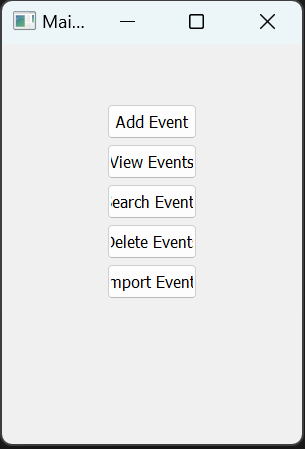

#### Adding events to Google Calendar
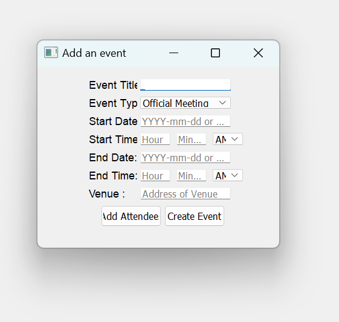

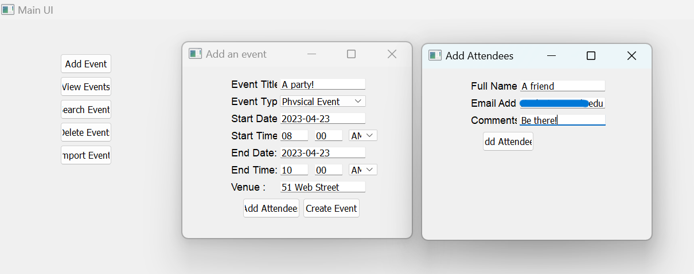

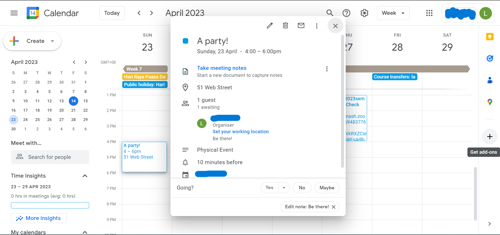

#### Searching for events
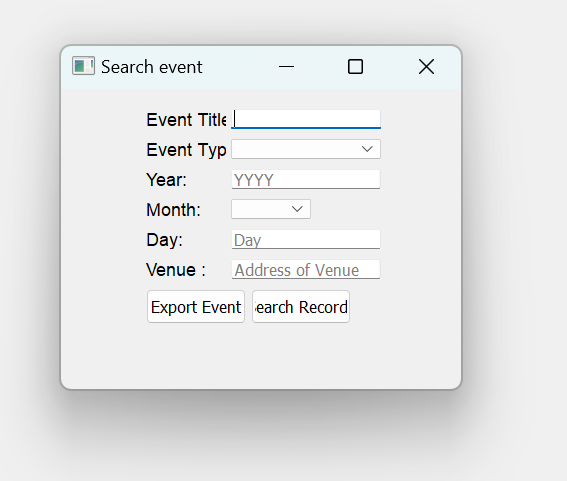

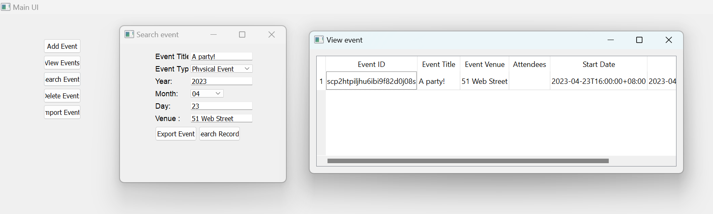

#### Exporting events
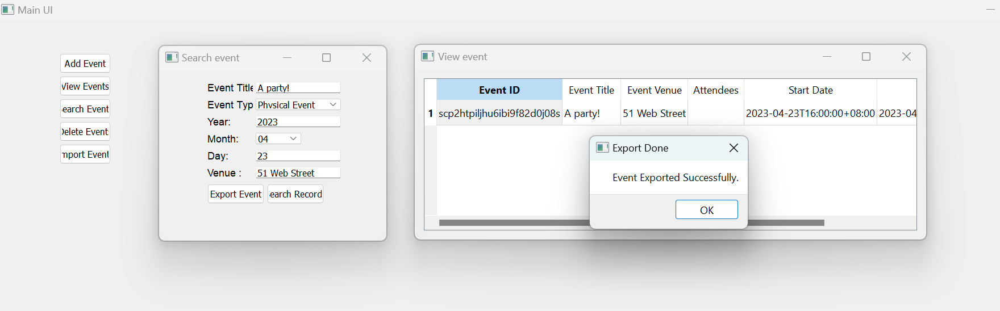

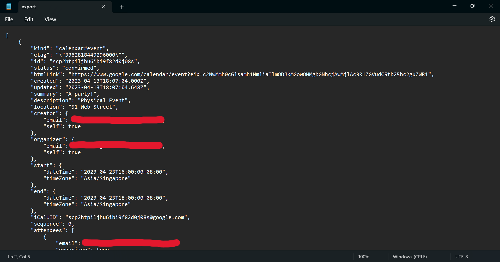

#### Display your events
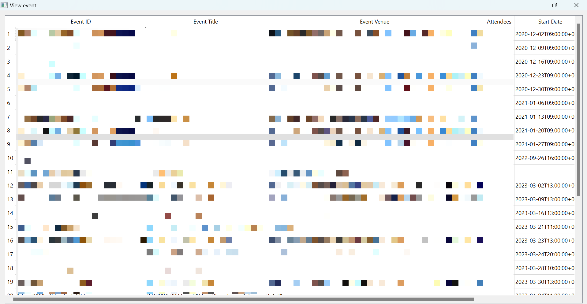

#### Importing events into Google Calendar
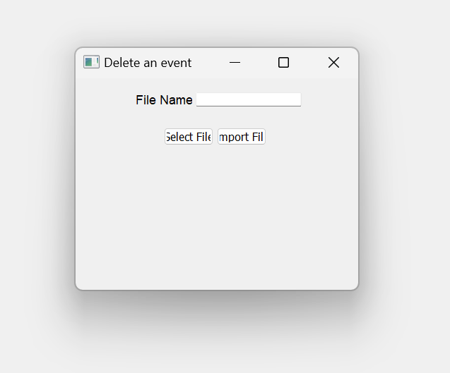

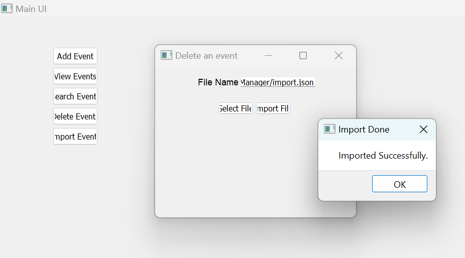

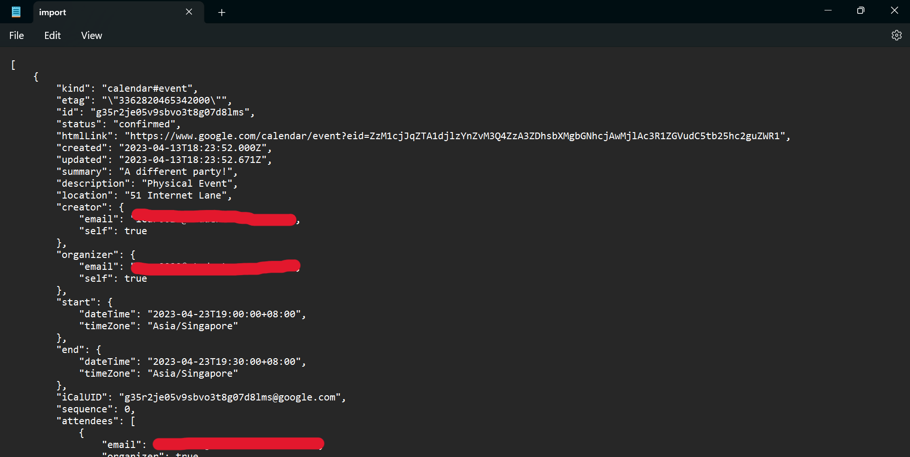

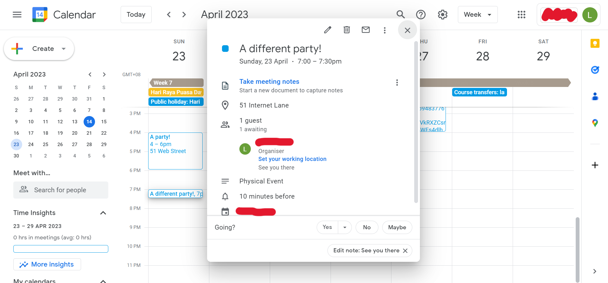

## Use Instructions <a name="use">

#### Download:

**IMPORTANT:** Python and an IDE is required to use the application. Additionally, permission must be granted by the developer to use the application.

##### Obtaining access to the application

1. Contact [laicarson.swe@gmail.com](laicarson.swe@gmail.com) to obtain a credential file to access the application. 
2. Place the **credentials.json** file obtained in Step 1 within the same directory as **MyEventManager.py**.
3. Run **MyEventManager.py** using an IDE with Python installed in your system. The application will launch a new window.

#### Using the application

Refer to [Preview](#preview).

## Additional Information <a name="info">

Developed using Python, PyUnit and Qt.

The final application presented in this repository is an adapted version from a university project. Developed in collaboration with Rosheen Rajeesh and Cheng Zi Ming.

For enquires, contact [laicarson.swe@gmail.com](laicarson.swe@gmail.com).

